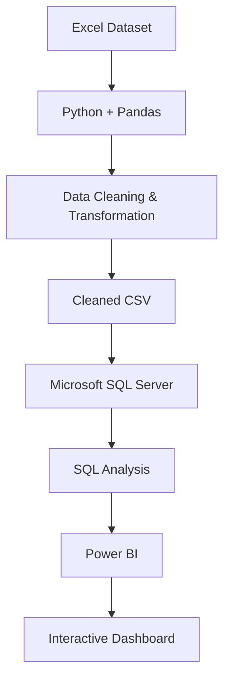

## **Customer Shopping Behavior Analysis**

**Overview**
An end-to-end Data Analytics project focused on analyzing customer shopping behavior, purchasing patterns, and business performance.

The project follows a structured analytics workflow, starting with data cleaning and preprocessing in Python/Pandas, followed by analytical querying in Microsoft SQL Server, and concluding with an interactive Power BI dashboard for data visualization and business insights.

**Project Workflow**

**Objectives**

- Clean and preprocess raw customer shopping data.
- Transform and prepare data for analysis.
- Perform business-oriented analysis using SQL.
- Identify customer purchasing and sales patterns.
- Analyzed key performance indicators.
- Develop an interactive Power BI dashboard.
- Present data-driven insights through effective visualizations.

