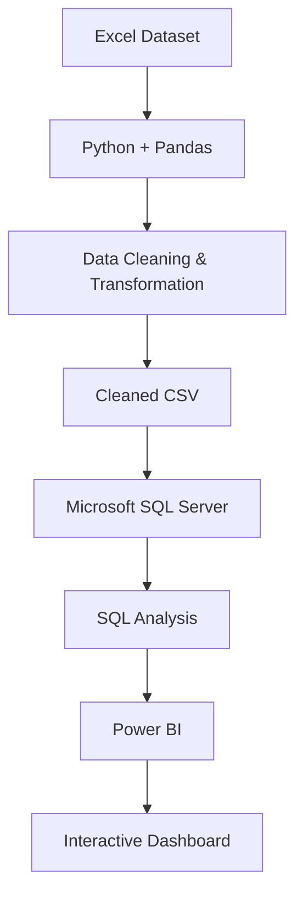

## **Customer Shopping Behavior Analysis**

**Overview**
An end-to-end Data Analytics project focused on analyzing customer shopping behavior, purchasing patterns, and business performance.

The project follows a structured analytics workflow, starting with data cleaning and preprocessing in Python/Pandas, followed by analytical querying in Microsoft SQL Server, and concluding with an interactive Power BI dashboard for data visualization and business insights.

**Project Workflow**

**Objectives**

- Clean and preprocess raw customer shopping data.
- Transform and prepare data for analysis.
- Perform business-oriented analysis using SQL.
- Identify customer purchasing and sales patterns.
- Analyzed key performance indicators.
- Develop an interactive Power BI dashboard.
- Present data-driven insights through effective visualizations.

**Technology Stack**

- Excel - Source dataset
- Python - Data preprocessing and cleaning
- Pandas - Data manipulation and transformation
- Google Colab - Data cleaning environment
- SQL - Business and analytical queries
- Power BI - Data visualization and dashboard development

**1.Data Cleaning & Preprocessing**
The raw Excel dataset was imported into Google Colab and processed using Python and Pandas.

**Key Activities**
Data quality assessment
Missing-value handling
Duplicate detection and removal
Data type validation
Column standardization
Data transformation
Feature/column preparation for analysis
Data consistency checks

The cleaned dataset was exported as a CSV file for further analysis in SQL Server.

**2. SQL Server Analysis**
The cleaned CSV dataset was imported into Microsoft SQL Server for structured data analysis.
SQL was used to transform the cleaned data into meaningful analytical results and answer business-related questions.

**SQL Concepts Used**
SELECT
WHERE
GROUP BY
ORDER BY
Aggregate Functions
CASE
Joins
Subqueries
Common Table Expressions (CTEs)
Window Functions

**Analysis Areas**
Revenue and sales performance
Customer purchasing behavior
Purchase frequency
Product/category performance
Customer segmentation
Subscription behavior
Customer ratings
Discount usage
Average purchase analysis

**3. Power BI Dashboard**
The SQL-analyzed data was connected to Power BI to develop an interactive business intelligence dashboard.

**Dashboard Features**
KPI cards
Interactive slicers
Filters
Customer analysis
Sales analysis
Category analysis
Subscription analysis
Product performance
Interactive charts and visualizations

**Key Metrics**
Total Revenue
Total Customers
Average Purchase Amount
Total Purchases
Average Rating
Subscription Rate

The dashboard enables users to interactively explore customer behavior and business performance across different dimensions.
