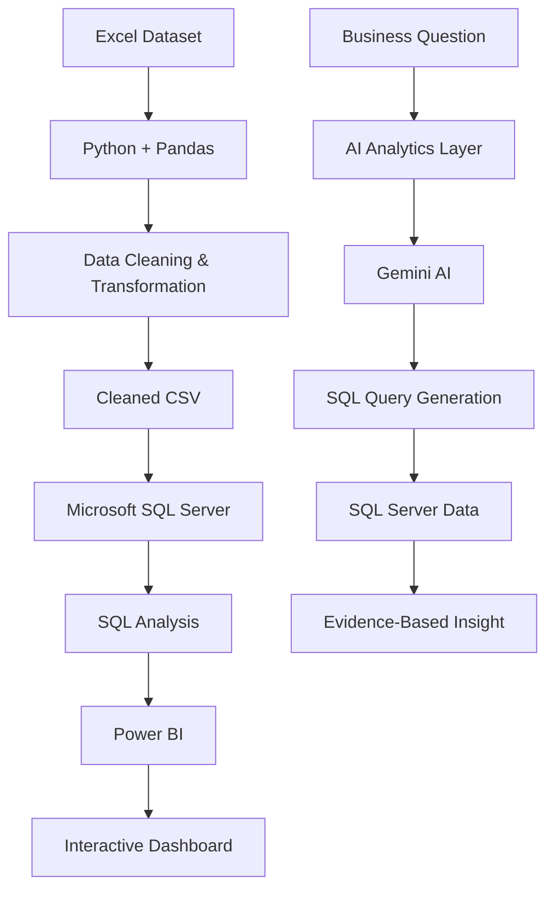
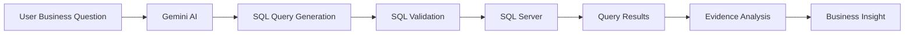
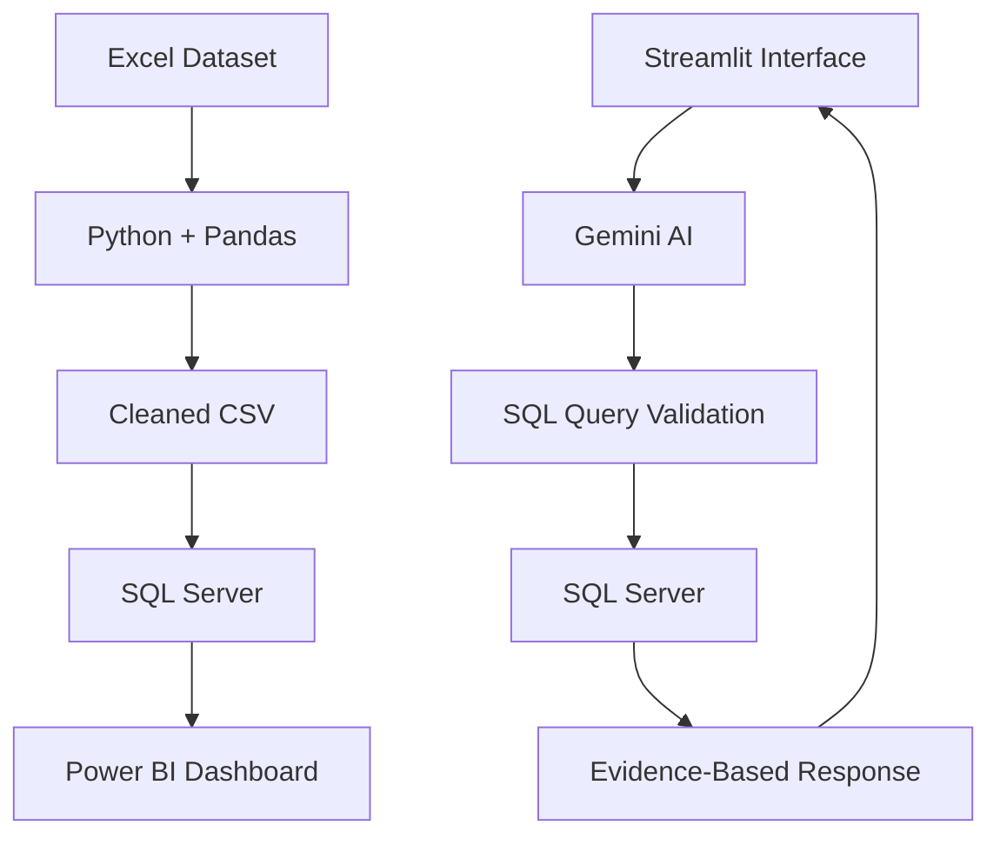

## **Customer Shopping Behavior Analysis**

**Overview**

An end-to-end Data Analytics project focused on analyzing customer shopping behavior, purchasing patterns, and business performance.

The project follows a structured analytics workflow, starting with data cleaning and preprocessing in Python/Pandas, followed by analytical querying in Microsoft SQL Server, an interactive Power BI dashboard, and an AI-powered analytics layer for answering business questions using real customer data.

**Project Workflow**

```mermaid
flowchart TD
    A[Excel Dataset]
    B[Python + Pandas]
    C[Data Cleaning & Transformation]
    D[Cleaned CSV]
    E[Microsoft SQL Server]
    F[SQL Analysis]
    G[Power BI]
    H[Interactive Dashboard]
    I[AI Analytics Layer]
    J[Business Question]
    K[Gemini AI]
    L[SQL Query Generation]
    M[SQL Server Data]
    N[Evidence-Based Insight]

    A --> B
    B --> C
    C --> D
    D --> E
    E --> F
    F --> G
    G --> H

    J --> I
    I --> K
    K --> L
    L --> M
    M --> N
```

**Objectives**

* Clean and preprocess raw customer shopping data.
* Transform and prepare data for analysis.
* Perform business-oriented analysis using SQL.
* Identify customer purchasing and sales patterns.
* Analyze key performance indicators.
* Develop an interactive Power BI dashboard.
* Build an AI-powered analytics layer for natural-language business questions.
* Generate SQL queries based on user questions.
* Provide evidence-based insights using actual database results.
* Present data-driven insights through effective visualizations.

**Technology Stack**

* Excel - Source dataset
* Python - Data preprocessing and AI application logic
* Pandas - Data manipulation and transformation
* Google Colab - Data cleaning environment
* Microsoft SQL Server - Data storage and analytical queries
* SQL - Business and analytical queries
* Power BI - Data visualization and dashboard development
* Streamlit - Interactive AI analytics interface
* Google Gemini - Natural-language question understanding and analysis
* python-dotenv - Environment variable management
* PyODBC - SQL Server database connectivity

---

**1. Data Cleaning & Preprocessing**

The raw Excel dataset was imported into Google Colab and processed using Python and Pandas.

**Key Activities**

* Data quality assessment
* Missing-value handling
* Duplicate detection and removal
* Data type validation
* Column standardization
* Data transformation
* Feature/column preparation for analysis
* Data consistency checks

The cleaned dataset was exported as a CSV file for further analysis in SQL Server.

---

**2. SQL Server Analysis**

The cleaned CSV dataset was imported into Microsoft SQL Server for structured data analysis.

SQL was used to transform the cleaned data into meaningful analytical results and answer business-related questions.

**SQL Concepts Used**

* SELECT
* WHERE
* GROUP BY
* ORDER BY
* Aggregate Functions
* CASE
* Joins
* Subqueries
* Common Table Expressions (CTEs)
* Window Functions

**Analysis Areas**

* Revenue and sales performance
* Customer purchasing behavior
* Purchase frequency
* Product/category performance
* Customer segmentation
* Subscription behavior
* Customer ratings
* Discount usage
* Average purchase analysis

---

**3. Power BI Dashboard**

The SQL-analyzed data was connected to Power BI to develop an interactive business intelligence dashboard.

**Dashboard Features**

* KPI cards
* Interactive slicers
* Filters
* Customer analysis
* Sales analysis
* Category analysis
* Subscription analysis
* Product performance
* Interactive charts and visualizations

**Key Metrics**

* Total Revenue
* Total Customers
* Average Purchase Amount
* Total Purchases
* Average Rating
* Subscription Rate

The dashboard enables users to interactively explore customer behavior and business performance across different dimensions.

---

**4. AI Analytics Layer**

An AI-powered analytics layer was developed on top of the SQL Server customer database to allow users to ask business questions using natural language.

Instead of manually writing SQL queries, users can enter questions such as business performance, customer behavior, category analysis, or improvement-related questions through a Streamlit interface.

The AI interprets the question, generates appropriate SQL queries, executes them against the customer database, and uses the returned data as evidence for generating the final response.

**AI Analysis Workflow**

```mermaid
flowchart LR
    A[User Business Question]
    B[Gemini AI]
    C[SQL Query Generation]
    D[SQL Validation]
    E[SQL Server]
    F[Query Results]
    G[Evidence Analysis]
    H[Business Insight]

    A --> B
    B --> C
    C --> D
    D --> E
    E --> F
    F --> G
    G --> H
```

**AI Layer Features**

* Natural-language business questions
* Automatic SQL query generation
* SQL query validation
* Read-only database analysis
* Evidence-based responses
* Diagnostic analysis for "why" and "how to improve" questions
* Multiple SQL analyses for complex business questions
* Customer segment analysis
* Revenue and category analysis
* Subscription analysis
* Location analysis
* Purchase behavior analysis
* Supporting metrics
* Evidence display
* Technical SQL details

**AI Analysis Process**

1. User enters a business question.
2. Gemini interprets the question.
3. A SQL Server `SELECT` query is generated.
4. The generated query is validated before execution.
5. The query is executed against `customer_table`.
6. The returned database results are collected as evidence.
7. Gemini analyzes the evidence.
8. The application presents the final business insight and relevant supporting metrics.

For diagnostic questions, the AI can generate multiple focused SQL queries to investigate different dimensions of the question before producing the final evidence-based analysis.

**AI Safety & Data Handling**

* Only `SELECT` queries are permitted for AI-generated analysis.
* Database modification commands are blocked.
* Generated queries are validated before execution.
* The AI is instructed to use only the available database schema.
* Insights are generated from actual SQL query results rather than invented values.
* API credentials are stored using environment variables rather than being exposed in source code.

---

**5. Streamlit AI Interface**

A Streamlit-based interface was developed to provide an easy-to-use front end for the AI analytics layer.

The interface allows users to:

* Enter natural-language business questions.
* Run AI-powered analysis.
* View key metrics.
* View business recommendations when relevant.
* Review supporting data.
* Inspect generated SQL through technical details.

The interface connects the AI layer with the SQL Server database and presents the analysis in a user-friendly format.

---

**Project Architecture**

```mermaid
flowchart TD
    A[Excel Dataset]
    B[Python + Pandas]
    C[Cleaned CSV]
    D[SQL Server]
    E[Power BI Dashboard]

    F[Streamlit Interface]
    G[Gemini AI]
    H[SQL Query Validation]
    I[SQL Server]
    J[Evidence-Based Response]

    A --> B
    B --> C
    C --> D
    D --> E

    F --> G
    G --> H
    H --> I
    I --> J
    J --> F
```

**Overall Project**

The project combines data preprocessing, SQL analytics, business intelligence, and natural-language AI analysis into a single customer analytics solution.

**Core Workflow:**

**Excel → Python/Pandas → SQL Server → Power BI**

**AI Workflow:**

**Business Question → Gemini AI → SQL Server → Evidence → Business Insight**

This architecture allows the project to support both traditional dashboard-based analysis and interactive AI-assisted exploration of customer data.
